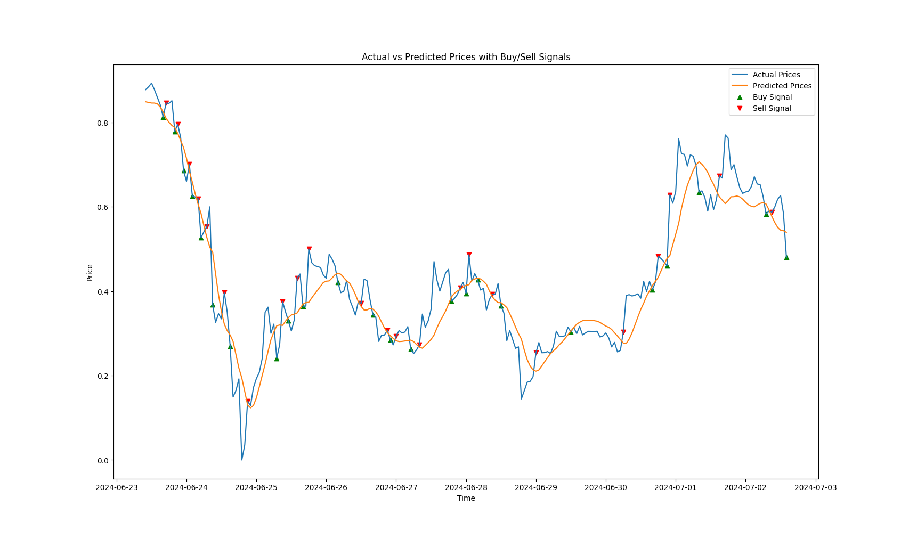

# Crypto Trading Project

## 项目简介
这个项目是一个加密货币交易系统，使用LSTM模型预测未来的加密货币价格，并基于这些预测执行交易策略。
项目包括数据收集、数据预处理、模型训练和策略回测等步骤。


- `main.py`：项目主文件，执行整个流程。
- `data_collection.py`：从OKX交易所收集加密货币的OHLCV数据。
- `data_preprocessing.py`：数据预处理和特征工程。
- `lstm_model.py`：构建和训练LSTM模型。
- `backtesting.py`：使用训练好的模型进行回测。

## 安装与运行

### 前提条件
- Python 3.6或以上版本
- 安装以下Python库：
  - `pandas`
  - `numpy`
  - `scikit-learn`
  - `tensorflow`
  - `matplotlib`
  - `ccxt`

### 安装步骤

1. **克隆仓库**
   ```bash
   git clone https://github.com/your-username/crypto_trading_project.git
   cd crypto_trading_project
   ```

2. **安装依赖**
   ```bash
   pip install pandas numpy scikit-learn tensorflow matplotlib ccxt
   ```

3. **配置OKX API密钥**
   - 在`data_collection.py`文件中，替换`YOUR_API_KEY`，`YOUR_SECRET_KEY`和`YOUR_API_PASSWORD`为你的实际OKX API密钥。

### 运行项目

1. **运行主文件**
   ```bash
   python main.py
   ```

2. **输出**
   - 数据收集、预处理、模型训练和回测的结果将显示在终端，并生成相应的文件。

### 项目步骤

1. **数据收集**
   - 使用`ccxt`库从OKX交易所获取历史OHLCV数据。
   - 数据保存到`btc_usdt_data.csv`文件中。

2. **数据预处理**
   - 对原始数据进行预处理和特征工程。
   - 生成的预处理数据保存到`processed_btc_usdt_data.csv`文件中。

3. **模型训练**
   - 使用LSTM模型进行训练，并保存模型到`lstm_model.keras`文件中。
   - 绘制训练和验证损失曲线。

4. **策略回测**
   - 使用训练好的模型对历史数据进行预测。
   - 根据预测结果生成交易信号，并计算最终资产价值和总回报率。
   - 绘制实际价格与预测价格，以及买卖信号的图表。

### 注意事项

- 确保你的API密钥安全，不要在公开的仓库中泄露。
- 由于加密货币市场的高波动性，实际交易时请谨慎使用此模型。

## 许可证
此项目基于MIT许可证开源，详情请参阅`LICENSE`文件。

